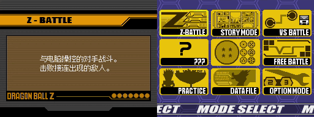
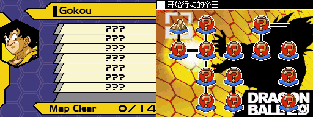

# Dragon Ball Z: Bukuu Ressen / 龙珠Z：舞空烈战 简体中文汉化

Nintendo DS 游戏《龙珠Z：舞空烈战》的简体中文本地化项目。当前版本已完成全部 3,100 条剧情文本、195 项角色资料卡，以及计划内的主要功能界面。

主界面演示：



技能描述演示：


故事模式演示：



演示图来自汉化 ROM 在 melonDS 下的测试。更多详细对比内容见[成果展示](docs/SHOWCASE.md)。

> [!IMPORTANT]
> 该项目由AI辅助开发，并由个人维护校对，如有疏漏，敬请批评指正。考虑版权因素，仓库不提供 ROM 文件，仅提供汉化补丁以供测试。

## 获取与安装

从 Releases 下载 `DBZ_Bukuu_Ressen_CN.bps`，使用支持 BPS 的工具（如 Floating IPS）将补丁应用到源 ROM。完整操作见 [安装补丁](docs/INSTALL.md)。

当前仅支持日版游戏：

```text
游戏代码   ADBJ
版本       Rev 0
文件大小   67,108,864 字节（64 MiB）
SHA-256    a18a79f4da2bc3d836645714092ec7c8b38ad53160078e26b854329d7fc9923e
```

## 项目状态

| 范围 | 状态 |
| --- | --- |
| 剧情文本 | 3,100 / 3,100 |
| 角色资料卡 | 195 / 195（37 个角色组） |
| 地图与挑战标题 | 232 / 232 |
| 模式、场景、练习、资料、存档与联机界面 | 已完成 |
| 制作人员名单 | 不在计划内 |
| 风格化英文标题、Logo 与角色罗马字名 | 按原版保留 |

支持范围、发布哈希和已知限制见 [项目状态](docs/STATUS.md)；后续维护计划见[路线图](docs/ROADMAP.md)。

## 技术概览

游戏中的文字分为两类，使用不同的本地化流程：

- **剧情文本**存储在脚本中，并由游戏字库渲染。构建器为缺失的简体字分配可回收的 Shift-JIS 编码槽，导入 12px 点阵字形，并在原命令容量内定长写回译文。
- **菜单、说明、标题和资料卡**是预渲染纹理，不存在运行时文字层。构建器按资源格式重绘指定文字区域，并验证边框、图标、调色板和其他语言资源保持不变。

完整设计见 [文件格式](docs/tech/FORMATS.md)、[字库工作流](docs/tech/FONTS.md)和[图片界面](docs/tech/ui/README.md)。

## 从源码构建

需要 Python 3.10+、[uv](https://docs.astral.sh/uv/) 和 Git。

```powershell
uv sync --frozen
uv run python tools/fetch_fonts.py
uv run python tools/build_release.py <原版 ROM>
```

`<原版 ROM>` 替换为自备的日版 Rev 0 备份路径；若放在约定位置 `work/original/`，多数辅助工具可省略该参数，详见[构建流程](docs/BUILDING.md)。

完整构建从经过校验的源 ROM 开始，依次应用剧情、字库和 12 个界面阶段，再生成并回放 BPS 补丁。可分发产物写入 `dist/`；本地生成的 `.nds` 仅用于验证，不得发布。

构建流程和命令行参数见 [构建流程](docs/BUILDING.md)与[工具参考](docs/TOOLS.md)。

## 开发与贡献

```powershell
uv sync --frozen
uvx ruff check src tools tests
uv run python -m unittest discover -s tests -v
uv run python tools/check_public_tree.py
uv run python tools/check_release_metadata.py
uv run python tools/check_glossary.py
```

剧情译文位于 [`data/translation/story_zh.tsv`](data/translation/story_zh.tsv)，界面译文位于同目录的 `ui_*.tsv`。游戏内换行使用字面量 `\n`。

欢迎提交译文校对、字形与排版修正、工具改进、测试结果和技术文档。提交变更前请阅读[贡献指南](CONTRIBUTING.md)，并确保提交中不包含 ROM、完整提取资源、存档或未获授权的第三方内容。

## 文档

| 文档 | 内容 |
| --- | --- |
| [文档索引](docs/README.md) | 面向玩家、贡献者和维护者的文档入口 |
| [安装补丁](docs/INSTALL.md) | 下载、应用和校验 BPS 补丁 |
| [成果展示](docs/SHOWCASE.md) | 界面与剧情文本对照 |
| [翻译规范](docs/TRANSLATION.md) | 文本格式、容量和校对要求 |
| [术语表](docs/GLOSSARY.md) | 角色、招式与能力译名 |
| [测试规范](docs/TESTING.md) | 自动化、模拟器和实机验证 |
| [贡献指南](CONTRIBUTING.md) | 开发环境、提交要求与内容边界 |

## 字体与第三方组件

中文字形来自以下开源像素字体：

| 字体 | 用途 | 许可 |
| --- | --- | --- |
| [Ark Pixel Font / 方舟像素字体](https://github.com/TakWolf/ark-pixel-font) | 剧情字库的主要 12px 简体字形 | SIL OFL 1.1 |
| [Fusion Pixel Font / 缝合像素字体](https://github.com/TakWolf/fusion-pixel-font) | 剧情缺字回退与 12px 图片界面正文 | SIL OFL 1.1 |
| [ZhengGeDianHei-16 / 正格点黑 16](https://github.com/yzdnn/ZhengGeDianHei-16) | 资料模式 16px 分类标题 | SIL OFL 1.1 |

仓库不提交字体文件。`tools/fetch_fonts.py` 下载并校验构建所需的固定版本；具体版本、哈希和许可见 [THIRD_PARTY_NOTICES.md](THIRD_PARTY_NOTICES.md)。

## 许可与声明

项目代码采用 [MIT License](LICENSE)。原创中文译文和项目文档采用 CC BY-NC-SA 4.0；第三方内容不在上述许可范围内。具体边界见 [LEGAL.md](LEGAL.md)。

本项目是非官方爱好者项目，与原游戏的权利人、开发商和发行商无关联。游戏名称、角色、图像、声音、程序和商标均归其各自权利人所有。
