# 成果展示

本页展示图片界面和剧情文本两类成果。图片界面直接取自 ROM 资源；剧情文本通过游戏自身的字库页渲染。

## 图片界面

菜单、说明、标题和资料卡均为预渲染像素。以下图像来自源 ROM 和补丁 ROM 中的同一资源，未经过重新排版或视觉模拟。

### 资料模式角色卡

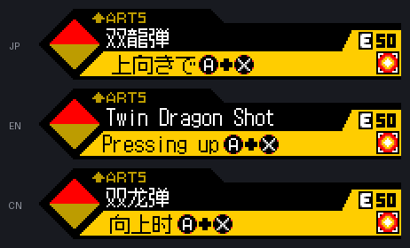

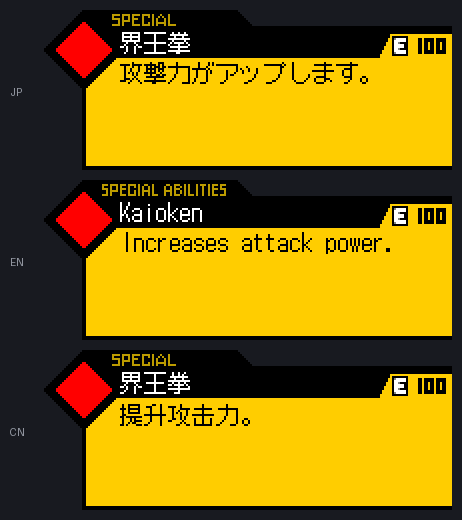

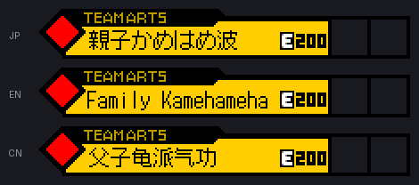

`ARTS`、`SPECIAL`、`TEAM ARTS` 等栏目名、能量值和按键图标属于原版美术，保持不变；只重绘日文招式名、操作条件和能力说明。详见[资料模式角色卡](tech/ui/12-character-data.md)。

### 剧情地图标题

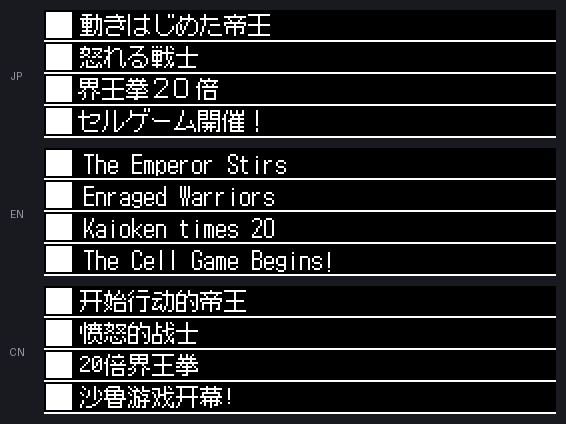

标题条行高只有 16 像素，中文全角标点会挤占正文空间，因此渲染为原版窄体标点。详见[地图标题](tech/ui/07-map-titles.md)。

## 剧情文本

以下对照图取自 16 条剧情路线，每条路线一例，覆盖对白、旁白、招式获得提示和操作说明四类文本。

三栏文字全部通过游戏自身的 2bpp 字库页渲染，而非排版软件模拟。因此图中的字形、字距和换行位置就是玩家在机器上看到的结果。日文与中文分别读自原版 ROM 和补丁 ROM 的同一个脚本位置，可直接对照。

官方英文版的剧情块和指令编号与日文版并不完全一致，无法按位置自动对齐。因此英文栏由展示数据单独维护，仅用于语义参考，其换行不代表英文版实机布局。

生成方式见[生成展示图](#生成展示图)。

## 容量约束

剧情文本采用定长回写，译文必须放进原日文命令预留的字节空间，超出即构建失败。全部 3,100 条中有 62 条恰好占满容量，下表中标注为 `满`。

这一约束直接影响译文取舍：占满容量的句子往往需要删掉冗余主语、改用更短的同义词，或重新分配断行位置，同时还要保持语气。

## 剧情对照

| 路线 | 编号 | 字节 | 对照图 |
| --- | ---: | ---: | --- |
| 魔人布欧篇 | 157 | 满 32/32 | [查看](assets/showcase/story-0157-bmr.png) |
| 布罗利 | 239 | 58/60 | [查看](assets/showcase/story-0239-brl.png) |
| 沙鲁篇 | 447 | 满 68/68 | [查看](assets/showcase/story-0447-cel.png) |
| 古拉 | 594 | 满 56/56 | [查看](assets/showcase/story-0594-col.png) |
| 克林 | 795 | 34/36 | [查看](assets/showcase/story-0795-crr.png) |
| 格罗博士 | 968 | 48/52 | [查看](assets/showcase/story-0968-drg.png) |
| 邪恶悟饭 | 1107 | 满 44/44 | [查看](assets/showcase/story-1107-egh.png) |
| 弗利萨 | 1299 | 满 56/56 | [查看](assets/showcase/story-1299-frz.png) |
| 基纽 | 1484 | 满 52/52 | [查看](assets/showcase/story-1484-gnu.png) |
| 悟饭 | 1737 | 满 60/60 | [查看](assets/showcase/story-1737-goh.png) |
| 悟空 | 1916 | 满 32/32 | [查看](assets/showcase/story-1916-gok.png) |
| 悟天克斯 | 2186 | 满 32/32 | [查看](assets/showcase/story-2186-gtk.png) |
| 比克 | 2385 | 66/68 | [查看](assets/showcase/story-2385-pic.png) |
| 特兰克斯 | 2579 | 38/40 | [查看](assets/showcase/story-2579-trk.png) |
| 教学 | 2892 | 38/40 | [查看](assets/showcase/story-2892-tut.png) |
| 贝吉塔 | 2916 | 满 32/32 | [查看](assets/showcase/story-2916-veg.png) |

### 对白

角色名单独占一行，正文随后。多行对白在原命令容量内重新分配断行。

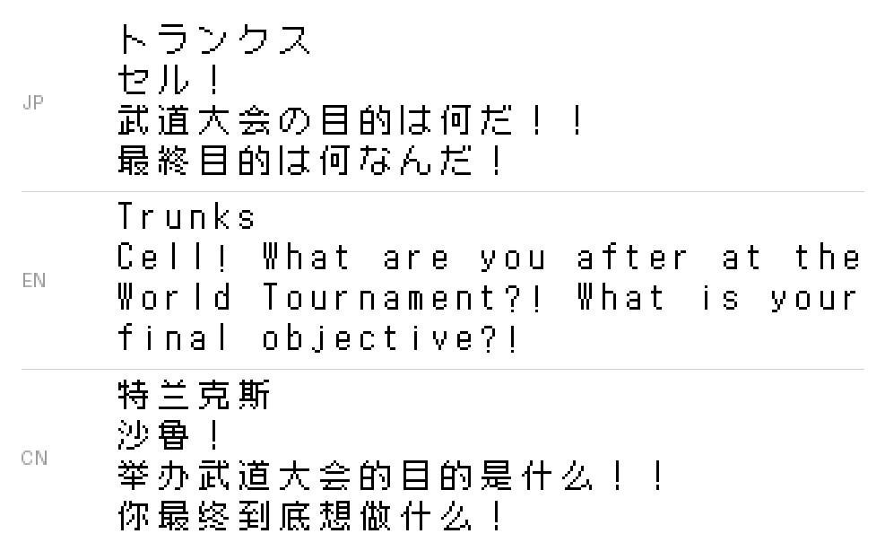

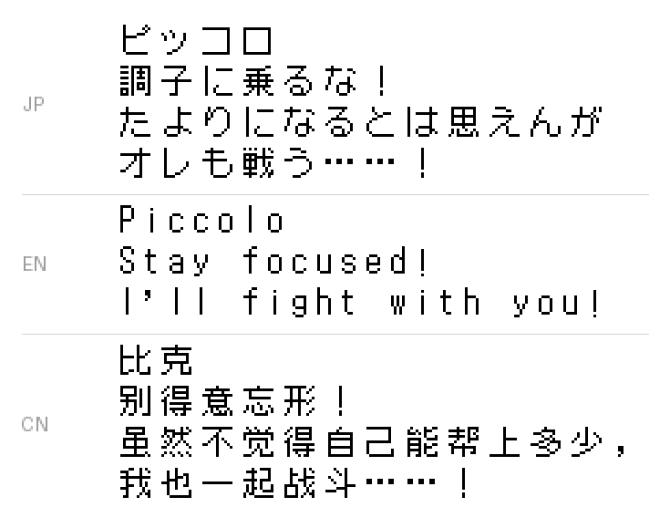

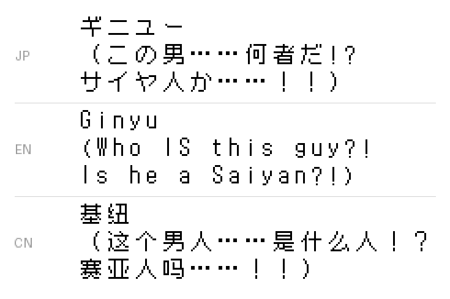

### 满容量文本

下面两例的译文字节数与原命令容量完全相等，没有任何余量。

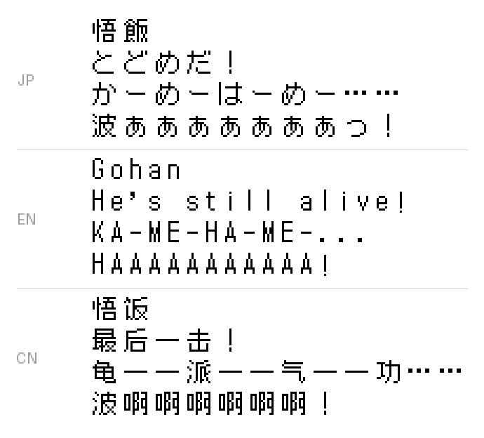

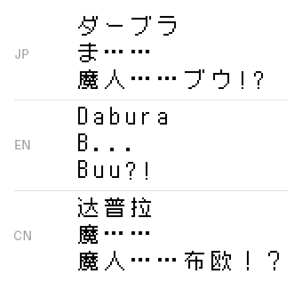

### 旁白与提示

招式获得提示需要与[角色状态页](tech/ui/11-character-status.md)和[资料模式角色卡](tech/ui/12-character-data.md)中的同名招式保持一致，否则玩家会误认为是两个不同的招式。

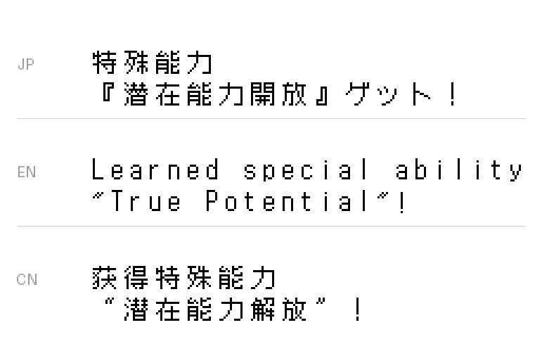

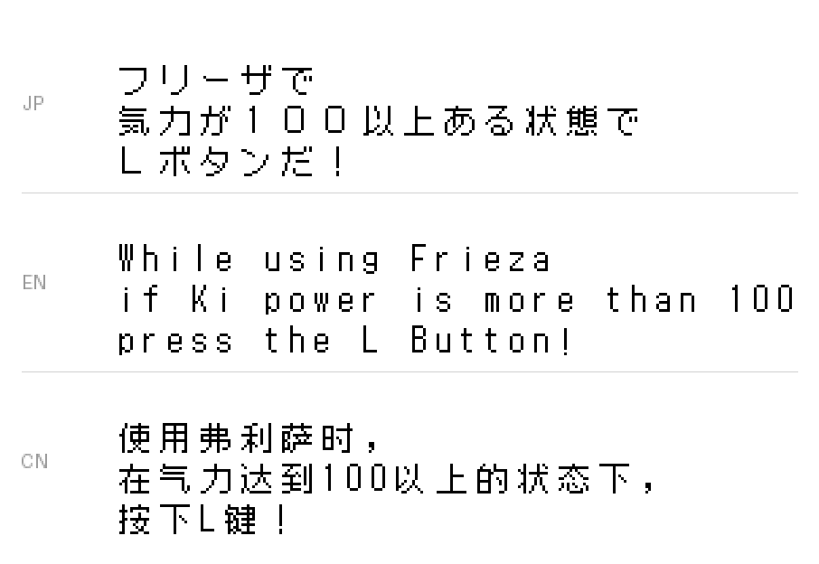

## 生成展示图

对照图由仓库内的工具生成，需要自备原版 ROM 和发布补丁：

```powershell
uv run python tools/render_showcase.py --source-rom "路径\DBZ_Bukuu_Ressen_ADBJ_Rev0.nds"
```

默认读取 `dist/` 中的发布 BPS 并在内存中打补丁；若已有补丁 ROM，可用 `--patched-rom` 直接指定。

展示清单位于 `data/showcase/story_samples.tsv` 和 `data/showcase/ui_samples.tsv`。剧情条目通过脚本代码、剧情块和指令序号定位；界面条目通过资源包、纹理和调色板名称定位。

## 版权说明

图中的日文原文、官方英文文本以及全部字形均属原游戏内容，版权归各自权利人所有，此处仅为说明本地化结果而少量引用。相关边界见[许可与版权边界](../LEGAL.md)。
